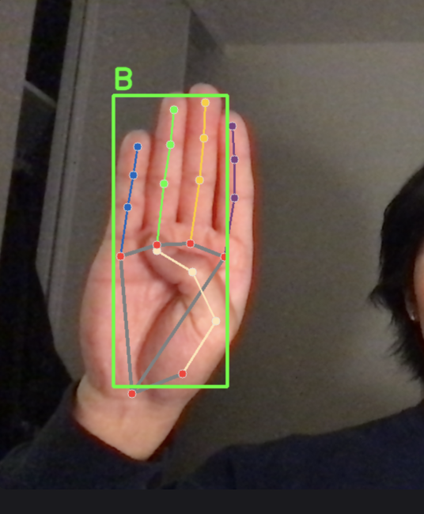

# Sign Language Detector (Python)

This project is a computer vision system for detecting sign language gestures using image classification. It includes tools for collecting images, creating datasets, training a model, and running inference on live input.

---

## Project Structure

- `collect_imgs.py`: Collects gesture images using your webcam and organizes them into folders.
- `create_dataset.py`: Processes and prepares the collected images into training data.
- `train_classifier.py`: Trains a classifier model to recognize different signs.
- `inference_classifier.py`: Runs real-time or batch inference using the trained model.

---

## Getting Started

Once cloning the project using `git clone https://github.com/prestonglee0805/Sign-Language-Detector.git`, activate the venv: 

`python3 -m venv venv`
`source venv/bin/activate  # on Windows: venv\Scripts\activate`

### Install Dependencies: 
Install all necessary dependencies from the requirements.txt file. Note that openCV has a longer download time. 

`pip install -r requirements.txt` 

### Image Collection 
You will be prompted to enter a label of A, B, C, ... Z and the script will activate your webcam to capture images for that label, storing in a separate data file. You will press 'q' to take images for each sign language symbol with your hand for each letter. In your terminal, run: 

`python collect_imgs.py` 

### Dataset Creation: 
Convert and structure the image data running:  

`python create_dataset.py` 

### Train the Classifier: 
Train the model by running in your terminal: 

`python train_classifier.py` 

### Make Predictions using the trained model:  
The next command will trigger the webcam and show live predictions of the hand: 

`python inference_classifier.py` 

## License

MIT License

Copyright (c) 2025 Preston L